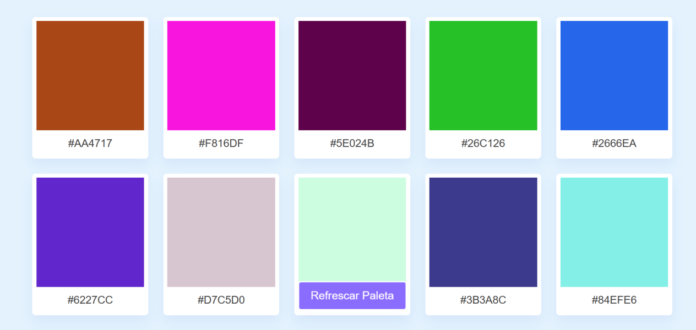

<h1>Color Generator</h1>
  

<h2>Project Deploy</h2>
 <a href="https://gerador-de-cores-40dszhc8c-lucaslandivar.vercel.app">Click here</a>
  
<h2>Description of the project</h2>

I made one more project, this time a color generator.
Colors have always been a weak point in my projects, I always stick to a color pattern or a color gradient, which over time, leaves my projects the same and without a unique style. I used this problem as a basis for my next project, again.
This project allows the user to choose between 12 color palettes, refreshing the page, the 12 palettes change, thus leaving 12 new palettes with new different colors.
The site is responsive and functional, in the future, I hope to improve it, putting a folder of favorites, where the user can keep the colors he liked the most.
I used the colorHunt website for inspiration and used html, css and javascript to make the project. Learning more and more about javascript.
 

<h2>Why i make this project?</h2>

I make this project so i can have a little help by choosing the color that i gonna use in my projects.

<h2>How does this project work?</h2>

There is a button in the bottom of the page, once the user click it the page will automatic refresh itself, leaving 12 new options of colors. The user can copy the code of the colors by clicking into the color.

<h2>Tecnologies</h2>

HTML

CSS

JavaScript

<h2>Status</h2>

Finish.

<h2>Author</h2>

Lucas Landivar de Morais

